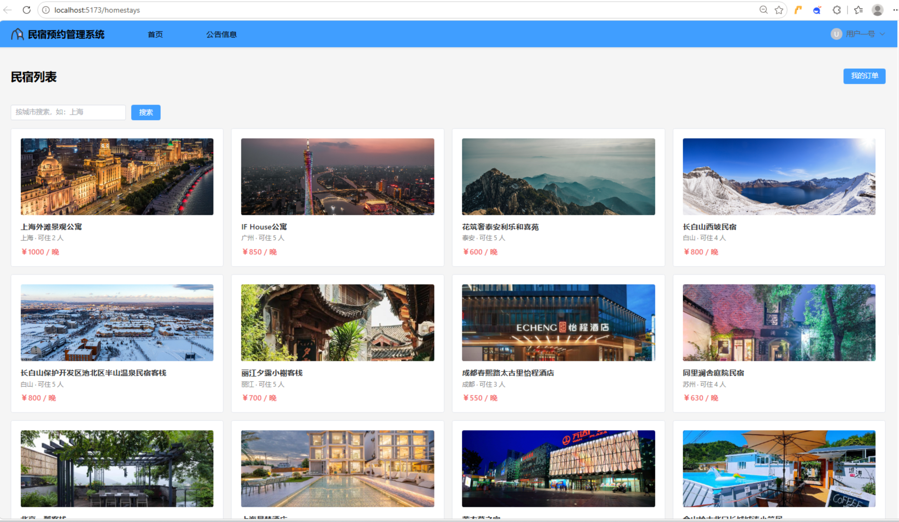
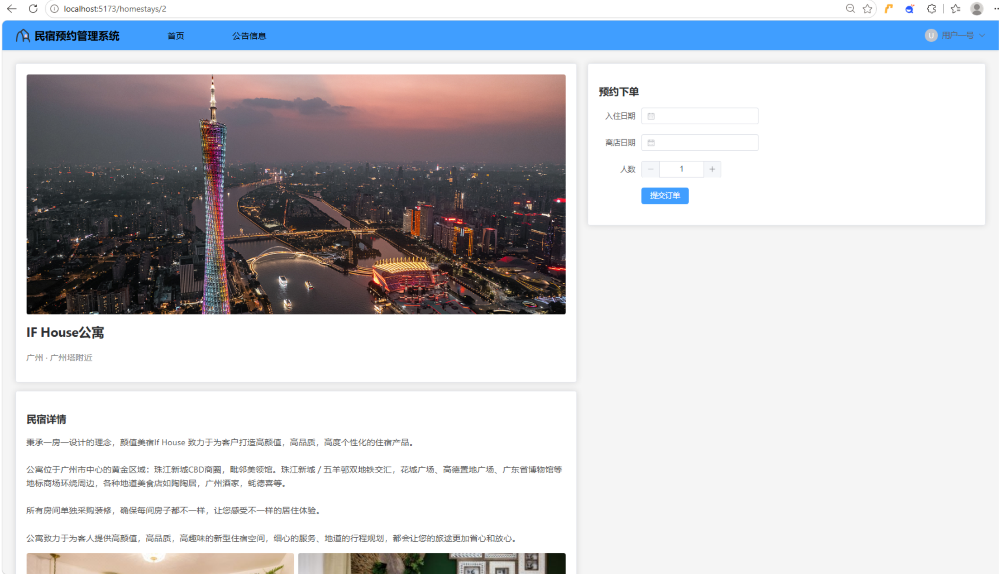
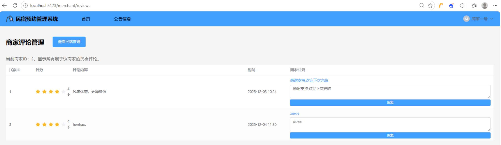
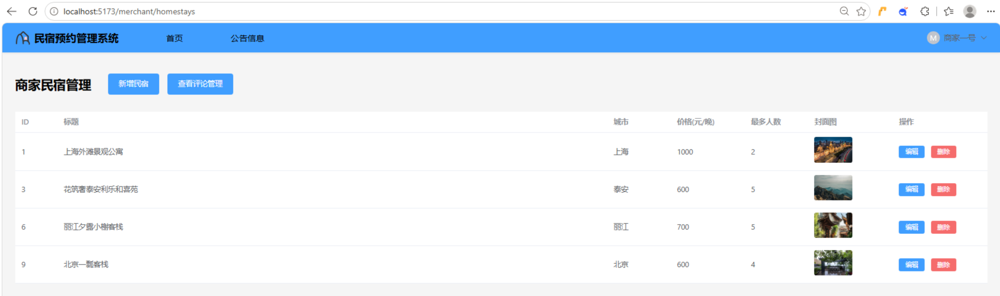
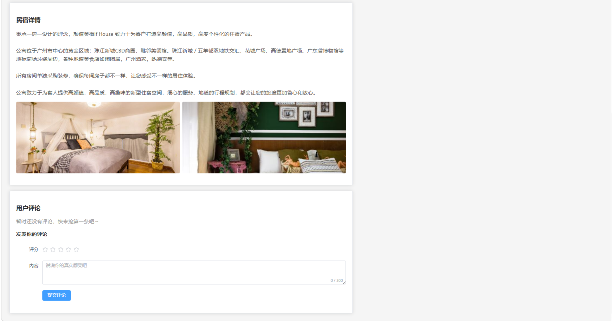

# 民宿预约系统

基于 **Spring Boot + Vue3** 开发的民宿预约平台，支持普通用户、商家、管理员三种角色。

## ✨ 功能特性

- **用户端**：浏览民宿、查看详情、在线预约下单、发表评论
- **商家端**：发布/管理房源、回复用户评论
- **管理员端**：用户管理、民宿管理、评论管理

## 🛠 技术栈

- 后端：Spring Boot + Spring Data JPA + MySQL
- 前端：Vue3 + Element Plus
- 工具：Maven + Git

## 📁 项目结构
```
├── src/main/java/com/example/homestay/
│ ├── controller/ # 控制器层，接收请求
│ ├── dto/ # 数据传输对象
│ ├── entity/ # 数据实体类
│ ├── repository/ # 数据访问层
│ └── service/ # 业务逻辑层
├── src/main/resources/
│ └── application.yml # 配置文件
└── pom.xml

homestay-booking-system/
├── backend/                              # 后端代码（Spring Boot）
│   ├── src/main/java/com/example/homestay/
│       ├── controller/                   # 控制器层，接收请求
│       ├── dto/                          # 数据传输对象
│       ├── entity/                       # 数据实体类
│       ├── repository/                   # 数据访问层
│       └── service/                      # 业务逻辑层
│    ├── src/main/resources/
│       └── application.yml               # 配置文件
│   ├── pom.xml
│   └── ...
├── frontend/                             # 前端代码（Vue3）
│   ├── public/                           # 公共静态资源
│   │   └── images/                       # 图片资源
│   │       ├── detail/                   # 详情页图片
│   │       ├── hotel/                    # 酒店/民宿相关图片
│   │       └── logo/                     # Logo图片
│   ├── src/                              # 源代码目录
│   │   ├── api/                          # API接口封装
│   │   ├── components/                   # 可复用组件
│   │   ├── router/                       # 路由配置
│   │   ├── views/                        # 页面视图组件
│   │   ├── App.vue                       # 根组件
│   │   └── main.js                       # 入口文件
│   ├── index.html                        # HTML模板
│   ├── package.json                      # 项目依赖配置
│   ├── package-lock.json                 # 依赖版本锁定
│   └── vite.config.js                    # Vite构建配置
├── screenshots/                          # 项目截图
└── README.md                             # 项目说明
```

## 🚀 快速启动

1. 创建 MySQL 数据库，执行相关 SQL 脚本
2. 修改 `application.yml` 中的数据库连接信息
3. 运行 `HomestayApplication.java`
4. 访问 `http://localhost:8080`

## 📸 项目截图

### 首页


### 民宿详情



### 后台管理



## 👤 作者

- [@Chaos6665](https://github.com/Chaos6665)
